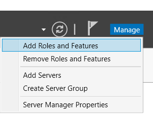
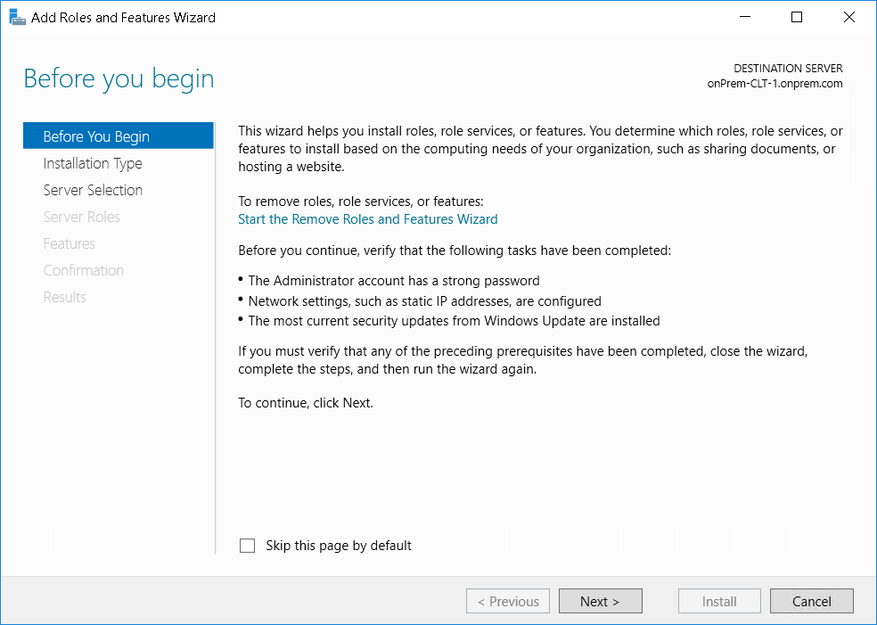
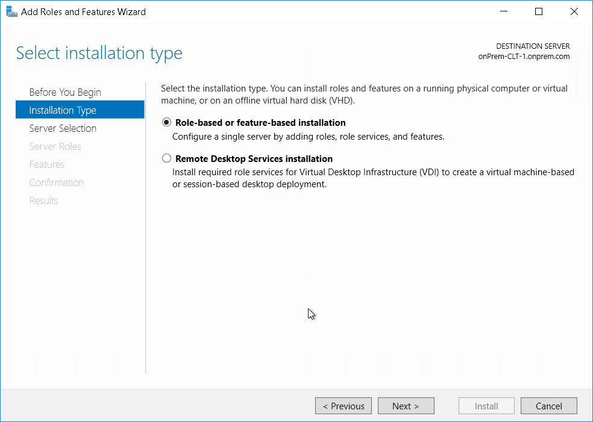
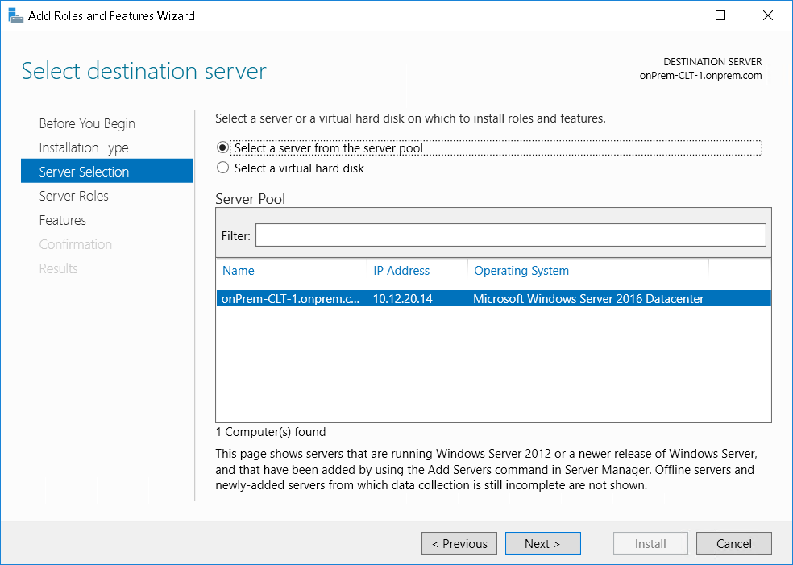
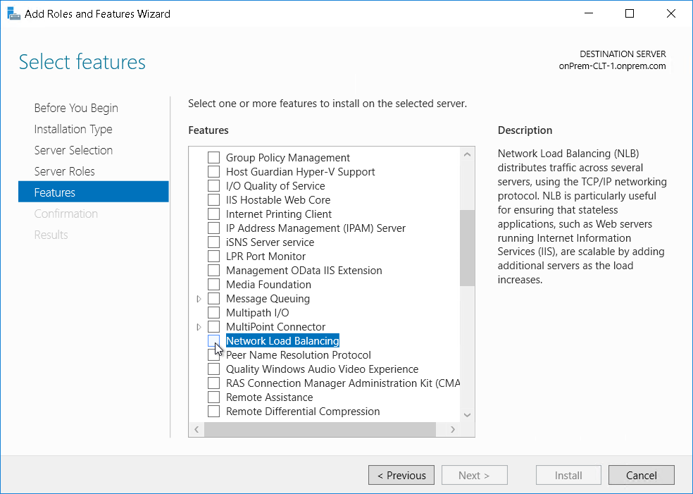
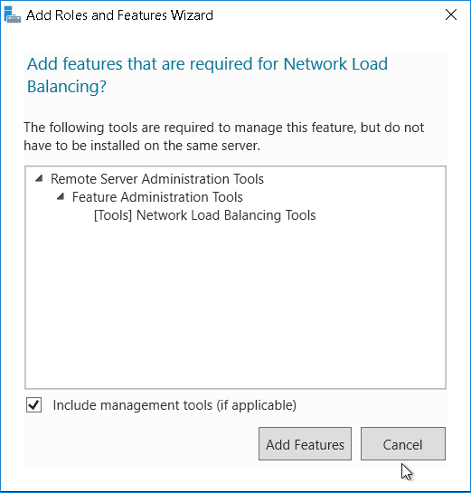
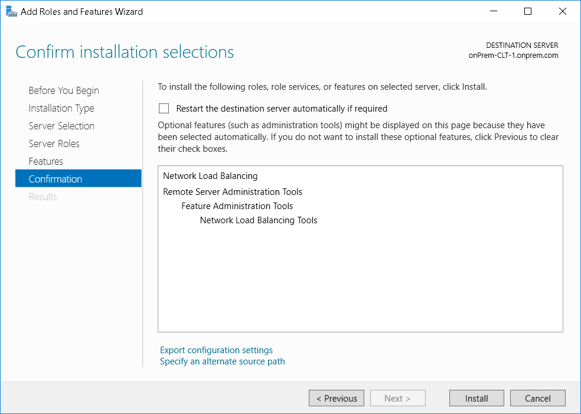

# NLB Guide

## Requirement

+ account local admin of all servers
+ 1 IP Address
+ DNS resolution on this IP
+ At least 2 Windows Servers

This documentation is based on Microsoft Documentation  (<https://docs.microsoft.com/en-us/iis/extensions/configuring-application-request-routing-arr/achieving-high-availability-and-scalability-arr-and-nlb>)

Schema :  

## NLB Configuration

The NLB configuration is divided into the following steps:

1. Install the NLB feature on all ARR servers.
2. Create NLB cluster for ARR.
3. Configure NLB for active/passive deployment.

 

### Install the NLB feature on **all** ARR Servers

1. Launch Server Manager

2. Click Next on default page

3. Select **Role-based or feature-based installation**

4. Select the server

5. Go to Features and select **Network Load Balancing**

6. Add required Features for NLB

7. Confirm Installation

Do the same for all servers involve in the network load balancing.

### Create NLB cluster for ARR

1. open the Network Load Balancing Manager from the Server Manager

2. Right-click on Network Load Balancing Clusters, and then select New Cluster.

3. In the New Cluster dialog box, in the Host text box, type the server address of one of the ARR servers.

4. Set the priority to 1.

5. Add the IP Address of the newload balancing cluster

6. Accept the default values

7. Click Finish to complete the creation of the NLB cluster.

### Add Host to the cluster

From the NLB manager, **Right-Click** on the cluster and select **Add Host to Cluter**

Follow the assistant to add the host to NLB Cluster like before.

### Configure the cluster for active / passive

From the NLB manager, **Right-Click** on the cluster and select **Cluster Properties**

Go the **Port Rules** tab

Click on **Edit** button

On the new window, select **Single Host** 

Click on **Ok** on the 2 windows to confirm the new configuration.